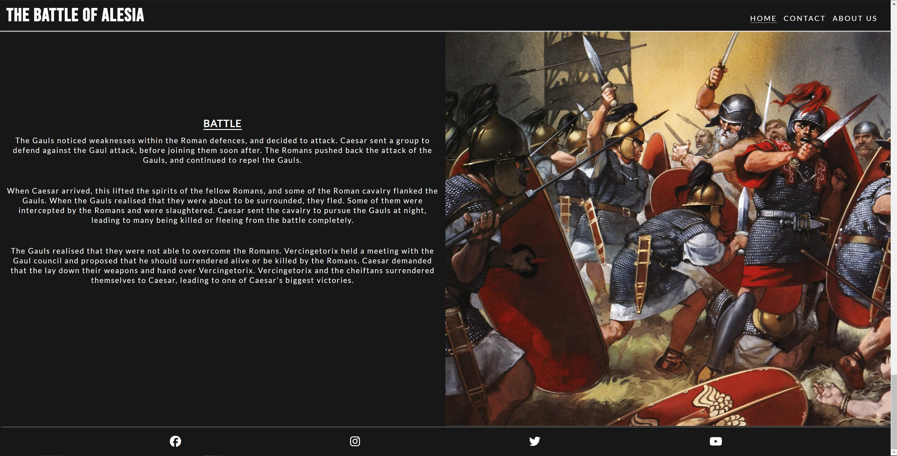
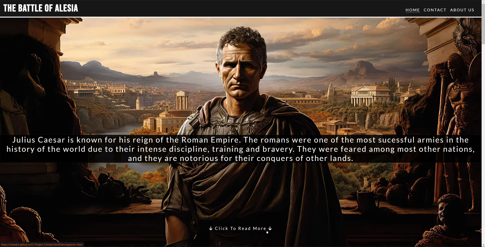
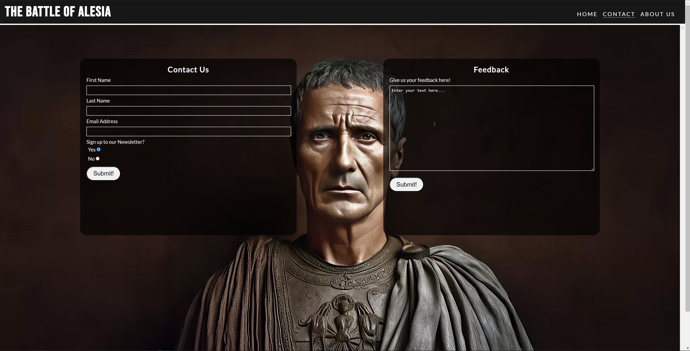
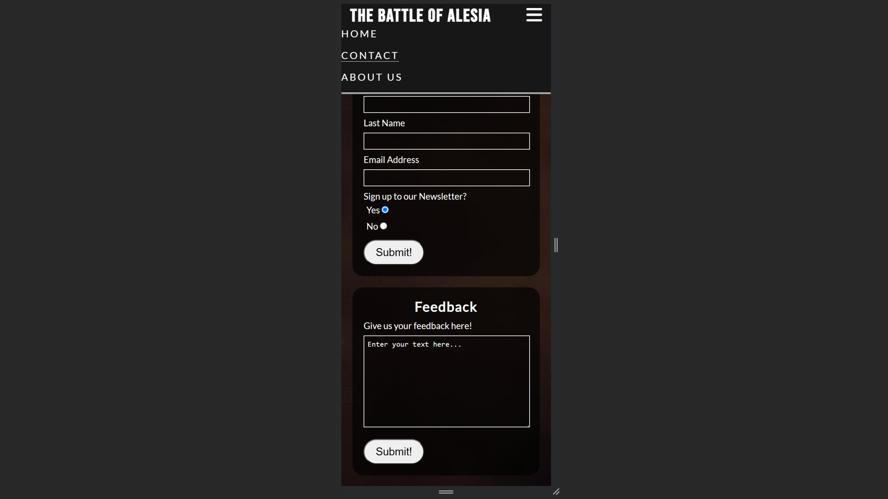

<h1 align="center">The Battle of Alesia</h1>

View the website [Here](https://maxxkm.github.io/CI-Project-1/)

This is a Website that explores the story of the great Battle of Alesia. The fight between Julius Caesar and Vercingetorix. This website aims to give visual and textual information about this part of history.

## User Experience (UX)

-  ### User Stories

   -  #### First Time Visitor Goals
        1. As a first time visitor, I want to understand and learn about the topic of the website.
        2. As a first time visitor, I want to be able to easily navigate through the website and also have visual help with guidance of the website and topics.
        3. As a first time visitor, I want to have reliable and trusted information about the topic at hand.

   -  #### Returning Visitor Goals
        1. As a returning visitor, I want to find information about the history of this battle.
        2. As a returning visitor, I want to be able to contact the team behind the website and be able to follow up and any questions or queries I may have.
        3. As a returning visitor, I want to find social media links to follow up on more information.
   
   -  #### Frequent User Goals
        1. As a frequent user, I want to see if there is any new or updated information about this topic or new releases of events in history.
        2. As a frequent user, I want to sign up to a newsletter for future updates and new blogs covering historical topics.

- ### Design
  - #### Colour Scheme
    - The two main colours used in this project are dark grey and white.
  - #### Typography
    - The font used for the Headings of this website is 'Bebas Neue' since it is quite bold and sharp which suits the topic of the website. The font used in the body of the website is 'Lato' since it is very clean and easy to read, especially with longer paragraphs of informational text. Both used 'Sans Serif' as a fallback font incase the other two fonts don't load.
  - #### Imagery
    - Imagery is incredibly informational and powerful when it comes to historical topics, since we need visual help on understanding how things would/could have looked back then. The website shows many powerful images of the main people involved in the battle, as well as some famous paintings of the events. Images are used beside informational text to further enhance the users imagation when learning.

- ### Wireframes
    - #### Home Page Wireframe -
    - #### About Page Wireframe -
    - #### Contact Page Wireframe -

## Features
  - #### Navigation Bar
    - Added features to the navigation bar such as the active page being underlined and if mouse is hovering over another page it will also be highlighted by an underline. This 
    allows the user to know which page they are currently on, as well as visual aid of what page they will be going onto next if they click.
    
  - #### Footer
    - Added social media links and icons to the footer. All links open in a new tab. This is an easy and visually pleasing way to have users gain access to your social media pages.
    The icons make the aesthetic of the page nicer, rather than have words or links to click.
    
  - #### Scroll Feature
    - Added scroll feature for the first section on the main page. When clicked it will scroll down to the next section. The allows users, especially on mobile to quickly navigate
    the opening slides, since the opening slide don't have much text, rather a brief introduction followed by powerful images.
    
  - #### Forms
    - Added forms section for contact and feedback sections. Added required feature to the contact form. The contact form allows users to send us their personal details, such as
    name and address, to send off to us to reply. This also allows users to sign up for a newsletter. The feedback form allows users to input long text, and send their feedback to us.
    
  - #### Responsiveness
    - Website is responsive to all screen sizes. For example, on mobile the nav bar is activated through the use of the burger icon. The text is still overlayed on certain images, so the user still experiences the visual aspects of the site. for longer text, the images shortly follow the text, to allow users to visualise what they have just read.
    
  
## Technologies Used

### Languages used

- [HTML5](https://en.wikipedia.org/wiki/HTML)
- [CSS3](https://en.wikipedia.org/wiki/CSS)

### Framesworks, Libraries & Programmes Used
    1. [Google Fonts](https://fonts.google.com/)
    Google Fonts was used to styles the font throughout the website.
    2. [Font Awesome](https://fontawesome.com/)
    Font Awesome was used to add the icons for the social media links in the footer, as well as the burger icon in the navbar for smaller screens.
    3. [Git](https://git-scm.com)
    Git was used for version control by utilizing the Gitpod terminal to commit to Git and push to GitHub.
    4. [GitHub](https://github.com/)
    GitHub was used to store the projects code after being pushed by Git.
    5. [Balsamiq](https://balsamiq.com)
    Balsamiq was used to make the wireframes, to plan the visual style and layout of the website before the initial code was written.
    6. [TinyJPG](https://tinypng.com/)
    TinyPNG was used to compress the images throughout the website and make the loading times faster and friendly for the users.