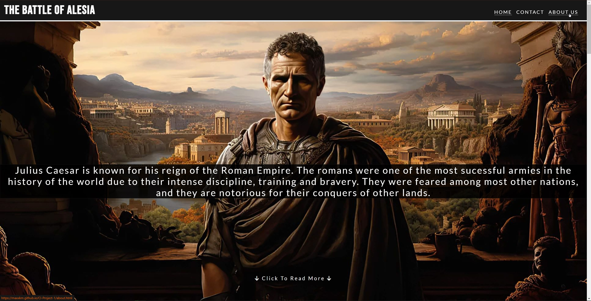

<h1 align="center">The Battle of Alesia</h1>

View the website [Here](https://maxxkm.github.io/CI-Project-1/)

This is a Website that explores the story of the great Battle of Alesia. The fight between Julius Caesar and Vercingetorix. This website aims to give visual and textual information about this part of history.

## User Experience (UX)

-  ### User Stories

   -  #### First Time Visitor Goals
        1. As a first time visitor, I want to understand and learn about the topic of the website.
        2. As a first time visitor, I want to be able to easily navigate through the website and also have visual help with guidance of the website and topics.
        3. As a first time visitor, I want to have reliable and trusted information about the topic at hand.

   -  #### Returning Visitor Goals
        1. As a returning visitor, I want to find information about the history.
        2. As a returning visitor, I want to be able to contact the team behind the website and be able to follow up and any questions or queries I may have.
        3. As a returning visitor, I want to find social media links to follow up on more information.
   
   -  #### Frequent User Goals
        1. As a frequent user, I want to see if there is any new or updated information about this topic or new releases of events in history.

- ### Design
  - #### Colour Scheme
    - The two main colours used in this project are dark grey and white.
  - #### Typography
    - The font used for the Headings of this website is 'Bebas Neue' since it is quite bold and sharp which suits the topic of the website. The font used in the body of the website is 'Lato' since it is very clean and easy to read, especially with longer paragraphs of informational text. Both used 'Sans Serif' as a fallback font incase the other two fonts don't load.
  - #### Imagery
    - Imagery is incredibly informational and powerful when it comes to historical topics, since we need visual help on understanding how things would/could have looked back then. The website shows many powerful images of the main people involved in the battle, as well as some famous paintings of the events. Images are used beside informational text to further enhance the users imagation when learning.

## Features
  - #### Navigation Bar
    - Added features to the navigation bar such as the active page being underlined and if mouse is hovering over another page it will also be highlighted by an underline. This 
    allows the user to know which page they are currently on, as well as visual aid of what page they will be going onto next if they click.
    
  - #### Footer
    - Added social media links and icons to the footer. All links open in a new tab. This is an easy and visually pleasing way to have users gain access to your social media pages.
    The icons make the aesthetic of the page nicer, rather than have words or links to click.
    
  - #### Scroll Feature
    - Added scroll feature for the first section on the main page. When clicked it will scroll down to the next section. The allows users, especially on mobile to quickly navigate
    the opening slides, since the opening slide don't have much text, rather a brief introduction followed by powerful images.
    
  - #### Forms
    - Added forms section for contact and feedback sections. Added required feature to the contact form. The contact form allows users to send us their personal details, such as
    name and address, to send off to us to reply. This also allows users to sign up for a newsletter. The feedback form allows users to input long text, and send their feedback to us.
    
  - #### Responsiveness
    - Website is responsive to all screen sizes. For example, on mobile the nav bar is activated through the use of the burger icon. The text is still overlayed on certain images, so the user still experiences the visual aspects of the site. for longer text, the images shortly follow the text, to allow users to visualise what they have just read.
    
  
## Technologies Used

### Languages used

- [HTML5](https://en.wikipedia.org/wiki/HTML)
- [CSS3](https://en.wikipedia.org/wiki/CSS)

### Framesworks, Libraries & Programmes Used

1. [Google Fonts](https://fonts.google.com/)
    Google Fonts was used to styles the font throughout the website.
2. [Font Awesome](https://fontawesome.com/)
    Font Awesome was used to add the icons for the social media links in the footer, as well as the burger icon in the navbar for smaller screens.
3. [Git](https://git-scm.com)
    Git was used for version control by utilizing the Gitpod terminal to commit to Git and push to GitHub.
4. [GitHub](https://github.com/)
    GitHub was used to store the projects code after being pushed by Git.
5. [Balsamiq](https://balsamiq.com)
    Balsamiq was used to make the wireframes, to plan the visual style and layout of the website before the initial code was written.
6. [TinyJPG](https://tinypng.com/)
    TinyPNG was used to compress the images throughout the website and make the loading times faster and friendly for the users.

## Testing
The W3C Markup Validator and W3C CSS Validator Services were used to validate every page of the project to ensure there were no syntax errors in the project.
 - [W3C Markup Validator](https://validator.w3.org/)
 - [W3C CSS VALDATOR](https://jigsaw.w3.org/css-validator/)

### Testing User Stories from User Experience (UX) Section

 - #### First Time Visitor Goals
   1. As a first time visitor, I want to understand and learn about the topic of the website.
      1. When users open the site, they are greeted with a clean and simple first page. The navigation bar is easy to read and easy to navigate through the pages.
      2. The main image is powerful yet clean. It is accompanied by small text with a black background for ease of reading, of a brief intro to the story.
      3. Users can either scroll or click the button that will automatically bring them down to the next intro section.
   2. As a first time visitor, I want to be able to easily navigate through the website and also have visual help with guidance of the website and topics.
      1. The navigation bar is clean and has visual help to show users what pages they are currently on. If a user wants to navigate to a different page this is highlighted when they hover over the page link.
      2. The navigation bar always shows each page so that users can always and easily go back to their previous page so they never feel trapped.
      3. The forms sections is clean and easily readable. When customers fill out their details, the form will show them what is required when filling it out so they are never confused.  
   3. As a first time visitor, I want to have reliable and trusted information about the topic at hand.
      1. The information about the story is always accumpanied by famous images that will support the reliability of the site. 
      2. All the information throughout the website has been gathered by multiple trusted sources to tell the story in short but precise text.
  
- #### Returning Visitor Goals

   1. As a returning visitor, I want to find information about the history.
      1. The about us section will provide users an insight of our motives and enthusiasm for history, that will give them an view of the passion behind the research and topics.
      2. Users can sign up to a newsletter through the contact forms, allowing them to keep up to date on previous or new historical topics. 
   2. As a returning visitor, I want to be able to contact the team behind the website and be able to follow up and any questions or queries I may have.
      1. All social media links are shown in the footer, so that users can follow us on multiple platforms and reach out if needed or wanted.
      2. Users can use the contact form to send us their details so that we can reach out and start up a conversation.
      3. Users can submit feedback about the site and topics, or give suggestions on the next topic that will be covered.  
   3. As a returning visitor, I want to find social media links to follow up on more information.
      1. Users can find all social media accounts on the footer, to follow us on updates.
      2. Users can find like minded people in the community for discussions. They can also give input on the future topics.
      3. Customers have easy access to a newsletter that will be emailed to them frequently.

- #### Frequent Visitor Goals

   1. As a frequent user, I want to see if there is any new or updated information about this topic or new releases of events in history.
      1. Through the newsletter, users will recieve all information and updates on new releases.

### Further Testing 
  - The website was viewed on multiple devices such as iphone 15, laptop, tablet, PC.
  - All page links and buttons were tested to ensure they are correctly working and have the correct links.
  - Family and Friends were sent links to the website to ensure no bugs were found on their own devices.

### Known bugs
  - Navigation bar was resizing itself throughout the project. This was fixed with the help of tutors, the code was not saving itself correctly but has been fixed.
  - Forms were falling through the footer and extending the page at certain points.

## Deployment

### Github pages
The project was deployed with GitHub using these steps...
  - Log in to Github and locate the GitHub repository 'CI-Project-1'
  - At the top of the repository locate the 'Settings' button.
  - Scroll down the settings page until you locate the 'GitHub Pages'.
  - Under 'Source', select 'none' and select master 'branch'.
  - The page will refresh
  - Scroll back down and locate the published site link in the 'GitHub pages' section.

### Preview Site Port
I also deployed a preview of the site throughout the process through a local port.
  - In codeanywhere I would select the terminal and write 'python3 -m https.server'
  - I would select the 'Port' tab in the bottom right.
  - I would select Port 8000 and click 'open in a new tab'.
 
## Credits

### Code
 - The navigation bar was followed along by [Code Institute's](https://codeinstitute.net/ie/) "Love Running" Project tutorials.
 - The scroll button used for 'click to view more' was helped by [Reddit](https://www.reddit.com/r/csshelp/) CSS form, since I was having problems with the button scrolling too far 
 past the section.   

 ### Content & Media
  - All content was written by the developer, but helped with multiple sources (including the images) such as ... 
    - [Wikipedia](https://en.wikipedia.org/wiki/Battle_of_Alesia)
    - [Britannica](https://www.britannica.com/event/Battle-of-Alesia-52-BCE)
    - [ImperiumRomanum](https://imperiumromanum.pl/en/battles/battle-of-alesia/)
    - [ThoughtCo](https://www.thoughtco.com/gallic-wars-battle-of-alesia-2360869)

### Acknowledgements
 - My mentor for continued help and feedback throughout the project.
 - The Code Institute tutor support team for help with problems within the code.   